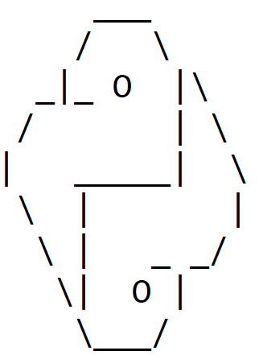

# About

"Try it yourself" section from Python Crash Course, 2nd Edition A Hands-On, Project-Based Introduction to Programming by Eric Matthes.

## Fair use disclaimer:

According to Section 107 of the Copyright Act: 
"the fair use of a copyrighted work […] for purposes such as criticism, comment, news reporting, teaching (including multiple copies for classroom use), scholarship, or research, is not an infringement of copyright."
This piece of code aims non-profit educational purposes.

